<div align="center">
  <a href="examples/project-intro-deck/project-intro.pptx">
    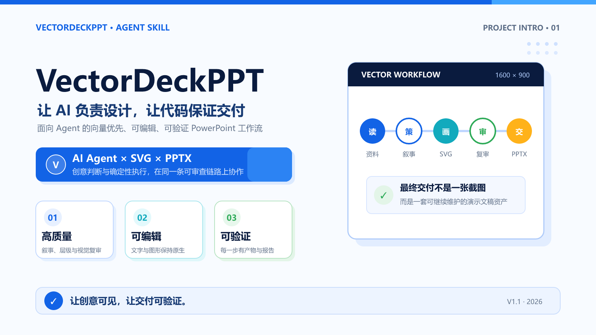
  </a>

  <h1>VectorDeckPPT</h1>

  <p>把资料变成可编辑、可审阅、可复现的 PowerPoint。</p>

  <p>
    <a href="https://github.com/AaaBinfinity/VectorDeckPPT/releases/latest"></a>
    
    
    <a href="LICENSE"></a>
  </p>

  <p>
    <a href="#preview"><strong>效果预览</strong></a> ·
    <a href="#quick-start"><strong>快速开始</strong></a> ·
    <a href="#workflow"><strong>工作流</strong></a> ·
    <a href="#capabilities"><strong>能力边界</strong></a> ·
    <a href="#documentation"><strong>文档导航</strong></a>
  </p>
</div>

---

VectorDeckPPT 是面向 AI Agent 的向量优先 PowerPoint 生成 Skill。宿主 Agent 负责阅读资料、规划叙事、定义视觉系统和逐页设计；仓库中的确定性工具链负责 SVG 校验、PNG 渲染、PPTX 编译和交付验证。

> VectorDeckPPT 不是另一个 AI API 应用，也不调用 AI Provider SDK。每一页 SVG 都是视觉真源；文本与基础图形优先转换为 PowerPoint 原生对象，无法可靠转换的可见元素必须明确降级或报错，绝不静默丢失。

## 为什么是 VectorDeckPPT

| 视觉真源 | 原生可编辑 | 工程可验证 |
|---|---|---|
| 一页一份结构化 SVG，设计、预览和后续修改都回到同一源文件 | 文本、基础图形、图片和直线段 freeform 优先编译为 PowerPoint 原生对象 | 校验、渲染、逐页复审、编译报告和 PPTX 包验证形成完整证据链 |

同时保留两道独立确认门：

- 先确认完整的文字版逐页内容；
- 再确认最多 3 页代表性视觉样稿；
- 两次批准后才生成全套 SVG 和最终 PPTX。

这让内容方向、视觉质量和批量生产彼此解耦，避免一开始就生成整套错误页面。

<a id="preview"></a>

## 效果预览

下面的图片来自仓库内同一套 10 页项目介绍 Deck，均由源 SVG 重新渲染。图片不是不可编辑的交付替代品：仓库同时提供源 SVG、可编辑 PPTX 和编译报告。

<table>
  <tr>
    <td width="50%" align="center">
      <a href="examples/project-intro-deck/slides/slide_06.svg">
        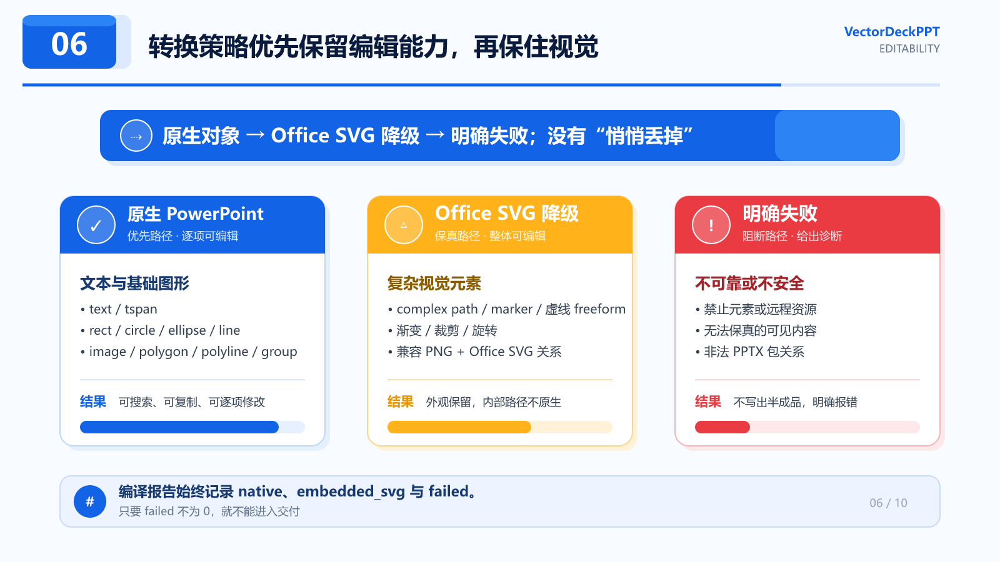
      </a>
      <br><strong>编辑能力可解释</strong>
      <br><sub>原生 PowerPoint → Office SVG 降级 → 明确失败</sub>
    </td>
    <td width="50%" align="center">
      <a href="examples/project-intro-deck/slides/slide_09.svg">
        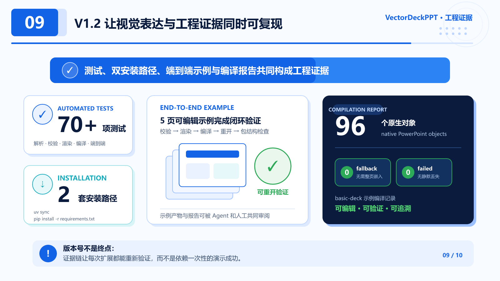
      </a>
      <br><strong>质量证据可复现</strong>
      <br><sub>测试、双安装路径、示例 Deck 与编译报告</sub>
    </td>
  </tr>
  <tr>
    <td colspan="2" align="center">
      <a href="examples/project-intro-deck/slides/slide_10.svg">
        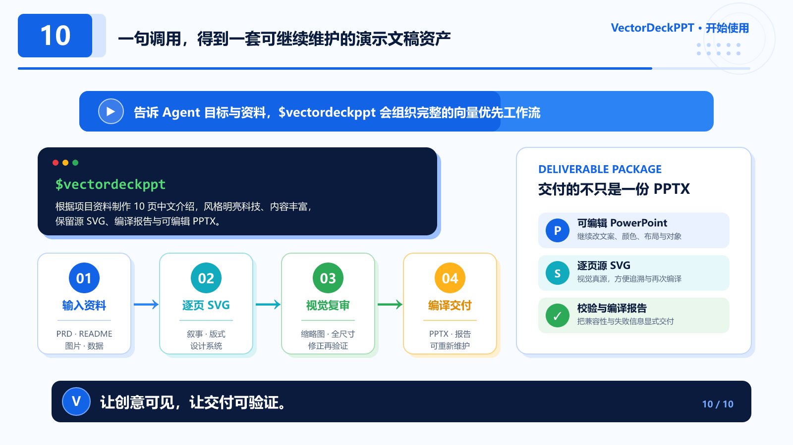
      </a>
      <br><strong>一句调用，交付完整演示资产</strong>
      <br><sub>PPTX、逐页源 SVG、PNG 预览、文字稿与 compilation-report.json</sub>
    </td>
  </tr>
</table>

<p align="center">
  <a href="examples/project-intro-deck/project-intro.pptx"><strong>下载可编辑示例 PPTX</strong></a> ·
  <a href="examples/project-intro-deck/slides/">查看 10 页源 SVG</a> ·
  <a href="examples/project-intro-deck/compilation-report.json">查看编译报告</a>
</p>

### 八套内置视觉方向

每套模板都展示封面、流程、证据和决策综合四类信息丰富页面，并提供同名 SVG 源文件。它们用于帮助 Agent 提取视觉语法，不是固定页壳或整页背景。Agent 会根据真实内容重新建立字体、空间、色彩、图像和构图规则，并把标题、同级标题、正文、标签等角色锁定为整套一致的字号。

<table>
  <tr>
    <td width="33%" align="center">
      <a href=".agents/skills/vectordeckppt/assets/style-templates/bright-tech-systems.png">
        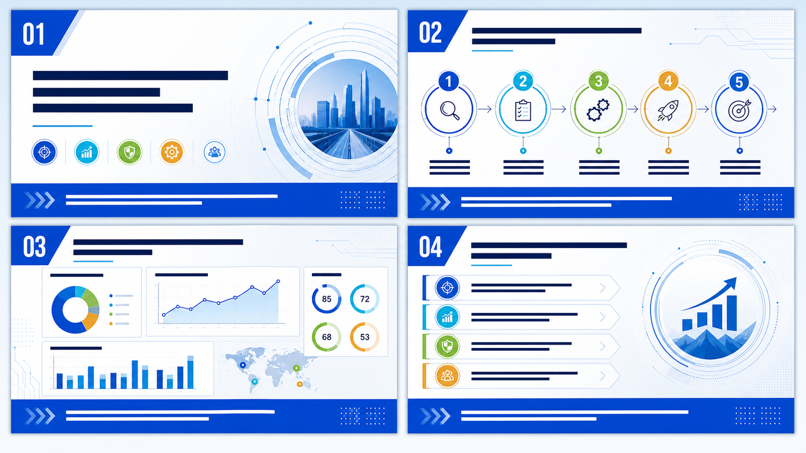
      </a>
      <br><strong>Bright Tech Systems</strong>
      <br><sub>技术产品 · AI 工作流 · 产品能力</sub>
    </td>
    <td width="33%" align="center">
      <a href=".agents/skills/vectordeckppt/assets/style-templates/editorial-intelligence.png">
        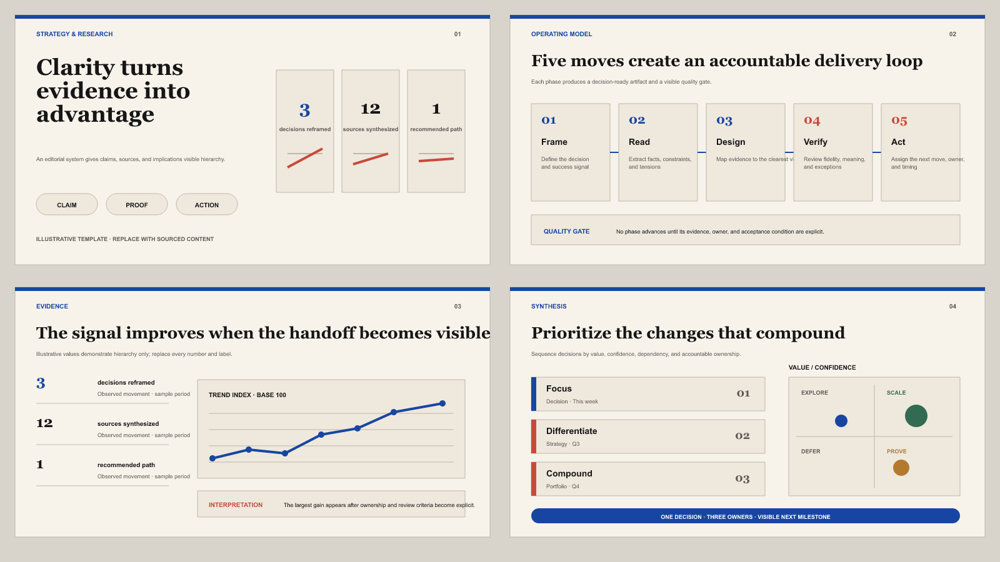
      </a>
      <br><strong>Editorial Intelligence</strong>
      <br><sub>研究报告 · 策略分析 · 数据叙事</sub>
    </td>
    <td width="33%" align="center">
      <a href=".agents/skills/vectordeckppt/assets/style-templates/dark-engineered-systems.png">
        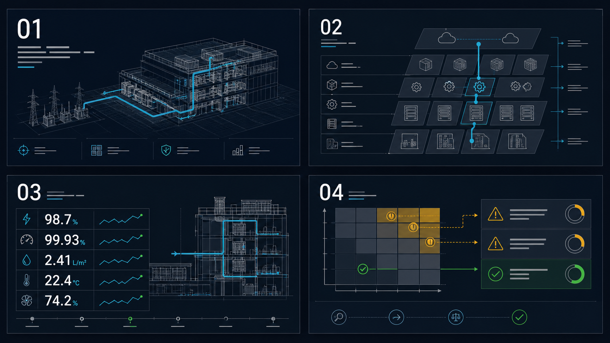
      </a>
      <br><strong>Dark Engineered Systems</strong>
      <br><sub>架构评审 · 基础设施 · 安全工程</sub>
    </td>
  </tr>
  <tr>
    <td width="33%" align="center">
      <a href=".agents/skills/vectordeckppt/assets/style-templates/human-documentary.png">
        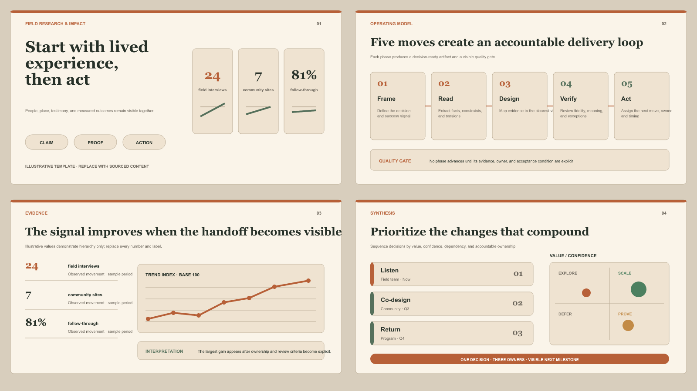
      </a>
      <br><strong>Human Documentary</strong>
      <br><sub>品牌故事 · 公共议题 · 人物现场</sub>
    </td>
    <td width="33%" align="center">
      <a href=".agents/skills/vectordeckppt/assets/style-templates/expressive-cultural.png">
        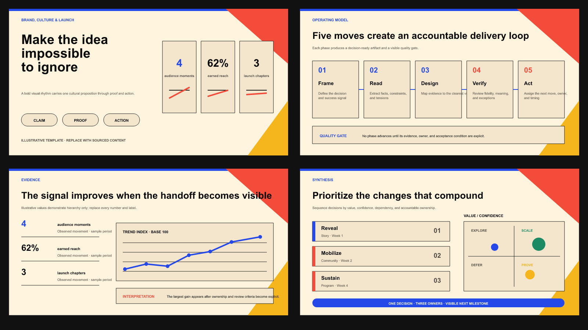
      </a>
      <br><strong>Expressive Cultural</strong>
      <br><sub>发布会 · 创意提案 · 文化与消费品牌</sub>
    </td>
    <td width="33%" align="center">
      <a href=".agents/skills/vectordeckppt/assets/style-templates/data-forward-clarity.png">
        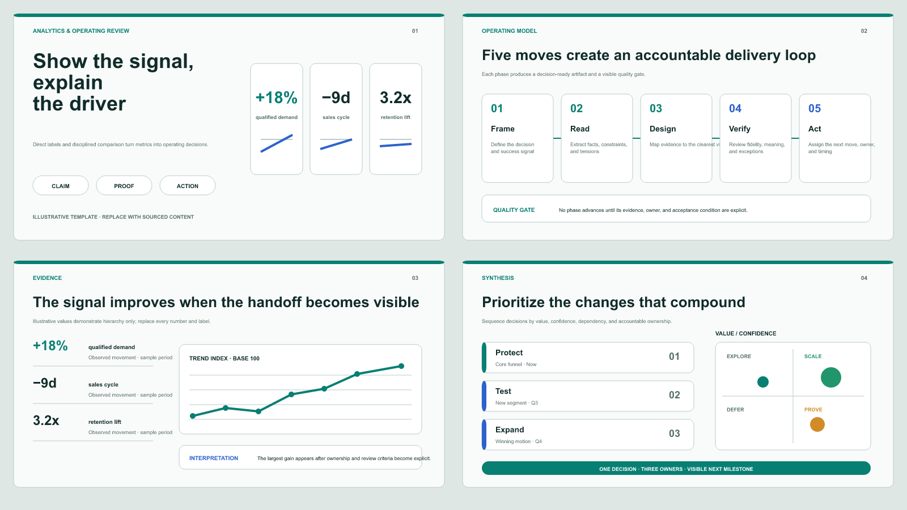
      </a>
      <br><strong>Data-Forward Clarity</strong>
      <br><sub>经营复盘 · KPI 汇报 · 数据分析</sub>
    </td>
  </tr>
  <tr>
    <td width="33%" align="center">
      <a href=".agents/skills/vectordeckppt/assets/style-templates/premium-restraint.png">
        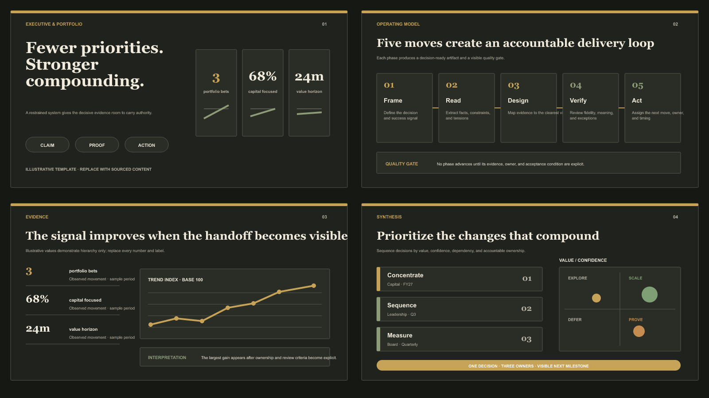
      </a>
      <br><strong>Premium Restraint</strong>
      <br><sub>高管建议 · 董事会 · 组合策略</sub>
    </td>
    <td width="33%" align="center">
      <a href=".agents/skills/vectordeckppt/assets/style-templates/product-storytelling.png">
        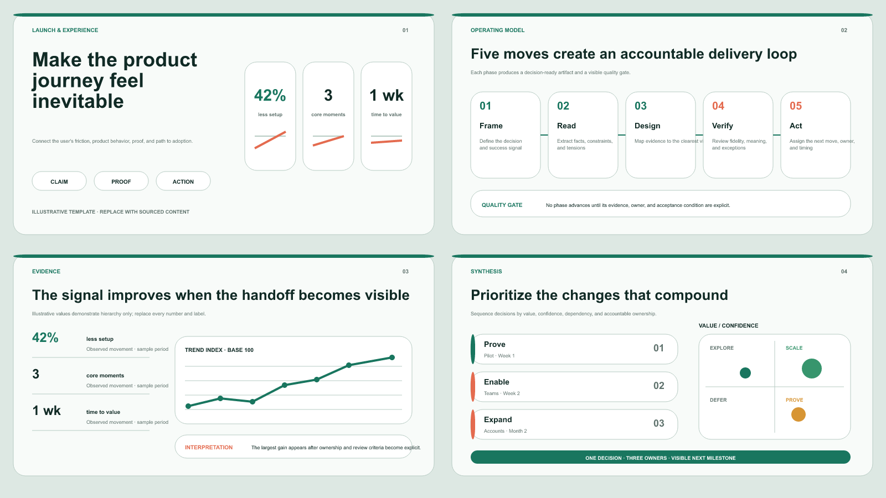
      </a>
      <br><strong>Product Storytelling</strong>
      <br><sub>产品发布 · 功能叙事 · 用户采用</sub>
    </td>
    <td width="33%" valign="middle">
      <strong>模板负责启发，不负责替代判断。</strong>
      <br><br>
      示例数字只用于展示信息层级，必须替换成真实来源。每套 PNG 旁都保留可检查的 SVG 源文件，便于复用字体角色、栅格和几何关系。
    </td>
  </tr>
</table>

浏览[完整模板目录](.agents/skills/vectordeckppt/assets/style-templates/)或阅读[视觉方向规则](.agents/skills/vectordeckppt/references/style-templates.md)。

<a id="quick-start"></a>

## 60 秒快速开始

### 1. 安装依赖

需要 Python 3.12+。推荐使用 uv：

```bash
uv sync
```

也支持标准 pip：

```bash
python -m venv .venv
python -m pip install --upgrade pip
python -m pip install -r requirements.txt
```

`requirements.txt` 从已提交的 `uv.lock` 导出，包含运行、测试和 lint 所需的锁定依赖。

### 2. 调用 Skill

在 Codex 中打开本仓库后，直接提出：

```text
使用 $vectordeckppt 根据 doc/PRD.md 制作一套 10 页中文项目介绍 PPT。
受众是开发者和潜在用户，目标是讲清项目定位、工作流、核心能力和使用方式。
视觉采用明亮科技系统，白底、深蓝与青色强调，内容丰富。
默认交付到当前目录的 pptoutput/。
```

Skill 会先提交完整文字版供确认；文字批准后只制作代表性视觉样稿；视觉批准后再完成全套页面。完整的安装方式、请求字段、审批逻辑、质量命令和报告解释见 [使用指南](doc/usage-guide.md)。

为了让叙事更准确，建议同时说明主要受众的身份、受众知识水平与决策权，以及演示结束后希望推动的具体行动。

<details>
<summary><strong>在其他项目中全局使用</strong></summary>

将完整目录复制或链接到个人 Skill 目录：

```text
$CODEX_HOME/skills/vectordeckppt/
```

未设置 `CODEX_HOME` 时通常是：

```text
~/.codex/skills/vectordeckppt/
```

不要只复制 `SKILL.md`；`references/`、`scripts/` 和 `assets/` 都是工作流的一部分。脚本从 `SKILL.md` 所在目录解析，不要求目标项目中存在 `.agents/`。

全局 Skill 不会自动创建 Python 环境。请在脚本实际使用的环境中安装本仓库 `requirements.txt` 的依赖，或复用已完成 `uv sync` 的仓库环境。

</details>

更多完整请求模板与商业汇报、技术评审、路演、PPT 重设计示例见 [提示词示例](doc/prompt-examples.md)。

<a id="workflow"></a>

## 工作流

<p align="center">
  <a href="examples/project-intro-deck/slides/slide_04.svg">
    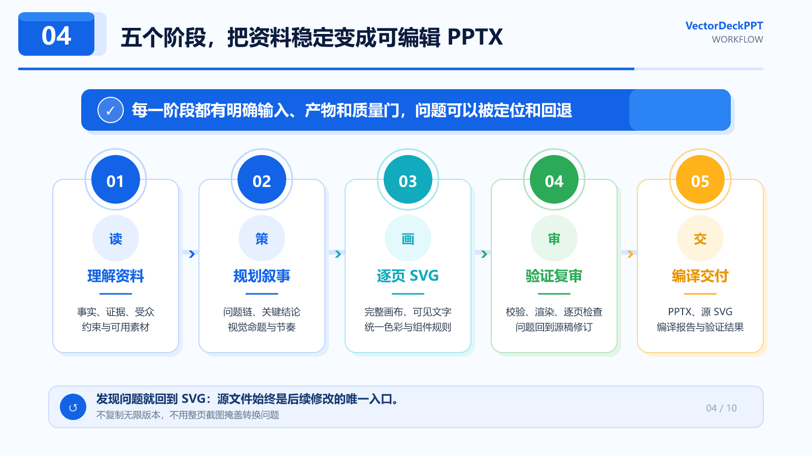
  </a>
</p>

| 阶段 | Agent / 工具的责任 | 质量门 |
|---|---|---|
| 1. 理解资料 | 提取事实、证据、受众、约束和可用素材 | 关键描述不准确或存在实质歧义时先提问 |
| 2. 规划叙事 | 生成完整的文字版逐页内容 | 等待用户明确批准文字内容 |
| 3. 定义视觉 | 建立艺术方向和设计系统，只制作最多 3 页代表性样稿 | 等待用户明确批准视觉样稿 |
| 4. 逐页 SVG | 完成所有页面，逐页校验、渲染和视觉复审 | 问题回到 SVG 源文件修订 |
| 5. 编译交付 | 生成原生优先的 PPTX、编译报告并验证包结构 | `failed` 必须为 `0` |

**默认内容密度：**普通内容页通常同时包含明确结论、解释、具体证据或例子，以及影响/行动；约三分之二的核心内容页应在资料允许时使用真正承担说明作用的图表、图解、表格、流程、矩阵或标注图。没有真实数据时使用诚实的概念结构；不得为了好看伪造数字、百分比或趋势。

**字体一致性：**设计样稿前先锁定整套字体角色。所有普通页面标题使用同一个精确字号、字体和字重，同一页的同级标题与标签也必须完全一致；最终 SVG 通过严格 typography audit 后才能编译。

## 交付物

未指定其他位置时，产物保存在当前工作目录的 `pptoutput/`：

```text
pptoutput/
├── slide-content.md
├── sample/
│   ├── slides/
│   └── preview/
├── slides/
├── assets/
├── preview/
├── compilation-report.json
└── final.pptx
```

| 产物 | 用途 |
|---|---|
| `slide-content.md` | 经用户批准的完整逐页文字内容 |
| `sample/` | 第二次确认使用的代表性 SVG 与 PNG 样稿 |
| `slides/` | 每页视觉真源，也是后续修改入口 |
| `preview/` | 全尺寸 PNG，用于逐页视觉复审 |
| `final.pptx` | 文本与基础图形尽可能原生可编辑的 PowerPoint |
| `compilation-report.json` | `native`、`embedded_svg` 与 `failed` 的逐页统计 |

`embedded_svg > 0` 表示相关对象只能整体编辑；`failed > 0` 表示不能进入交付。

<a id="capabilities"></a>

## 编译能力与边界

| 结果 | 当前行为 | 典型内容 |
|---|---|---|
| 原生 PowerPoint | 可搜索、可复制、可逐项修改 | `text` / `tspan`、`rect`、`circle`、`ellipse`、`line`、`image`、直线段 `polygon` / `polyline` |
| Office SVG 降级 | 外观保留，但内部路径不一定原生可编辑 | 复杂 `path`、marker、虚线 freeform、渐变、裁剪、旋转、斜切和不支持的文本基线 |
| 明确失败 | 阻止半成品交付并给出诊断 | 不安全元素、远程资源、无法保真的可见内容或非法 PPTX 包关系 |

当前不承诺完整 SVG 规范、`filter`、`mask`、SVG 动画或 PowerPoint 动画。准确的作者约束与转换表见 [SVG 作者指南](.agents/skills/vectordeckppt/references/svg-authoring.md) 和 [SVG → PPTX 说明](.agents/skills/vectordeckppt/references/svg-to-pptx.md)。

## 命令行工具

```bash
# 校验 SVG
uv run python .agents/skills/vectordeckppt/scripts/validate_svg.py slide.svg

# 检查整套标题与同级文字字号是否一致
uv run python .agents/skills/vectordeckppt/scripts/audit_typography.py slides/ --strict --json

# 渲染单页或整个目录
uv run python .agents/skills/vectordeckppt/scripts/render_svg.py slide.svg
uv run python .agents/skills/vectordeckppt/scripts/render_svg.py slides/ --output-dir preview/

# 编译 PPTX 并保存报告
uv run python .agents/skills/vectordeckppt/scripts/compile_pptx.py slides/ --output final.pptx --report compilation-report.json

# 验证 PPTX 包
uv run python .agents/skills/vectordeckppt/scripts/validate_pptx.py final.pptx
```

命令行工具负责确定性执行，不替代 Agent 的资料阅读、叙事规划、艺术指导和视觉复审。

<a id="documentation"></a>

## 文档导航

| 你想了解什么 | 推荐入口 |
|---|---|
| 如何调用 Skill | [使用指南](doc/usage-guide.md) · [SKILL.md](.agents/skills/vectordeckppt/SKILL.md) · [工作流](.agents/skills/vectordeckppt/references/workflow.md) · [提示词示例](doc/prompt-examples.md) |
| 如何定义视觉 | [艺术方向](.agents/skills/vectordeckppt/references/art-direction.md) · [设计系统](.agents/skills/vectordeckppt/references/design-system.md) · [页面设计](.agents/skills/vectordeckppt/references/slide-design.md) |
| 如何检查质量 | [字体审计](.agents/skills/vectordeckppt/scripts/audit_typography.py) · [视觉复审](.agents/skills/vectordeckppt/references/visual-review.md) · [故障排查](.agents/skills/vectordeckppt/references/troubleshooting.md) |
| 编译器如何工作 | [SVG 作者指南](.agents/skills/vectordeckppt/references/svg-authoring.md) · [SVG → PPTX](.agents/skills/vectordeckppt/references/svg-to-pptx.md) |
| 产品与版本 | [文档总览](doc/README.md) · [贡献指南](CONTRIBUTING.md) · [PRD](doc/PRD.md) · [CHANGELOG](CHANGELOG.md) · [V1.1 Release](doc/releases/v1.1.0.md) |

## 开发与验证

<details>
<summary><strong>仓库结构</strong></summary>

```text
VectorDeckPPT/
├── .agents/skills/vectordeckppt/
│   ├── SKILL.md
│   ├── agents/openai.yaml
│   ├── references/
│   ├── scripts/
│   │   └── lib/
│   └── assets/style-templates/
├── doc/
├── examples/
├── tests/
├── pyproject.toml
├── uv.lock
└── requirements.txt
```

`SKILL.md` 与 `references/` 定义 Agent 行为，`scripts/lib/` 保存可测试的确定性实现，`examples/` 提供可复现交付物，`doc/` 面向项目使用者和维护者。

</details>

```bash
uv run ruff format .
uv run ruff check .
uv run pytest
```

使用 pip 环境时，直接运行 `python <脚本路径> ...`，不要把文件路径写成 `python -m <脚本路径>`。依赖发生变化时，先更新 `uv.lock`，再导出 `requirements.txt`：

```bash
uv --no-managed-python export --format requirements.txt --all-groups --no-emit-project --no-hashes --frozen --output-file requirements.txt
```

提交前运行 `git diff --check`、Ruff 和 Pytest。开发环境、依赖同步、文档联动与发布检查见 [贡献指南](CONTRIBUTING.md)；Agent 的完整维护约束见 [AGENTS.md](AGENTS.md)。

## Roadmap

- 扩展复杂 `path` 到 PowerPoint freeform 的可编辑转换；
- 提升渐变、复杂路径和文本基线的跨平台保真；
- 增加更多真实演示类型的前向测试与示例 Deck；
- 持续优化视觉复审、编译报告和交付可追溯性。

## License

VectorDeckPPT 使用 [MIT License](LICENSE)。
